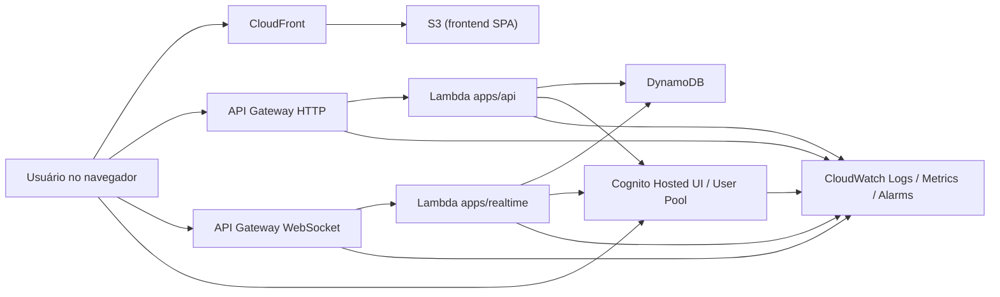

# Magic Life Counter — Arquitetura Técnica Alvo

## 1. Objetivo do documento

Este documento define a arquitetura alvo do Magic Life Counter para a Sprint 0 e serve como referência estrutural para os próximos sprints. Ele consolida stack oficial, componentes AWS, fluxos ponta a ponta, responsabilidades entre módulos, limites do sistema, estratégia de deploy, observabilidade e rationale técnico.

O objetivo principal desta etapa é reduzir retrabalho e remover ambiguidades antes da implementação dos projetos `web`, `api`, `realtime` e `infra`.

## 2. Contexto do produto

O Magic Life Counter é uma plataforma para criação e acompanhamento de partidas de Magic: The Gathering com atualização de totais de vida em tempo real entre múltiplos jogadores.

Objetivos centrais do produto:

- autenticar usuários com email/senha e Google OAuth
- permitir que usuários autenticados criem partidas
- permitir entrada em partidas por código ou link
- mostrar jogadores em grade com total de vida atualizado
- permitir que qualquer jogador da partida altere o total de vida de qualquer outro jogador
- sincronizar mudanças em tempo real para todos os clientes conectados
- expor listagem pública de partidas públicas com vagas abertas

Princípios não negociáveis:

- autorização sempre validada no backend
- backend como fonte única de verdade do estado da partida
- nenhuma atualização realtime deve contornar persistência e validação
- clientes devem poder re-sincronizar estado a partir de snapshot consistente

## 3. Decisões arquiteturais base

### 3.1 Monorepo

O projeto será organizado como monorepo com base única de código:

- `apps/web`: frontend React
- `apps/api`: API HTTP e serviços transacionais
- `apps/realtime`: handlers WebSocket e orquestração de conexões
- `packages/shared`: tipos, DTOs, schemas, eventos e constantes compartilhadas
- `infra`: infraestrutura AWS com CDK em TypeScript
- `docs`: documentação funcional, técnica e operacional

Rationale:

- reduz duplicação de contratos entre frontend e backend
- facilita evolução coordenada entre API HTTP, realtime e infraestrutura
- simplifica pipelines e versionamento da fundação do produto

### 3.2 Stack oficial

Frontend:

- React
- TypeScript
- Tailwind CSS
- aplicação SPA hospedada em S3 + CloudFront

Backend:

- Node.js
- TypeScript
- AWS Lambda para execução serverless

Infraestrutura:

- AWS CDK em TypeScript como ferramenta oficial de provisionamento

Autenticação:

- AWS Cognito User Pool
- Google OAuth via federação no Cognito

Persistência:

- Amazon DynamoDB

Realtime:

- Amazon API Gateway WebSocket
- AWS Lambda para handlers de conexão, assinatura e broadcast

Observabilidade:

- Amazon CloudWatch Logs
- métricas e alarmes no CloudWatch

Rationale:

- TypeScript ponta a ponta reduz divergência entre camadas
- arquitetura serverless combina com uso intermitente e simplifica operação inicial
- Cognito reduz custo de implementação de autenticação e federação
- DynamoDB atende bem padrão de acesso por chave, baixa latência e escalabilidade
- API HTTP e WebSocket separados deixam o sistema mais previsível e desacoplado

## 4. Visão de alto nível

Resumo do fluxo:

- o usuário acessa o frontend publicado em S3 e distribuído por CloudFront
- o frontend autentica o usuário por Cognito
- operações transacionais usam API HTTP
- sincronização em tempo real usa WebSocket
- DynamoDB persiste o estado e o histórico operacional
- CloudWatch concentra logs, métricas e alarmes

## 5. Componentes e responsabilidades

### 5.1 Frontend (`apps/web`)

Responsabilidades:

- autenticação do usuário via Cognito Hosted UI
- consumo da API HTTP para operações transacionais
- abertura e manutenção de conexão WebSocket autenticada
- renderização de snapshot inicial e aplicação de eventos realtime
- controle de navegação, estados de tela e UX

Responsabilidades que não pertencem ao frontend:

- cálculo final autoritativo do estado da partida
- validação definitiva de autorização
- persistência de atualizações de vida

Decisão importante:

- o frontend sempre carrega um snapshot inicial via HTTP e trata WebSocket como canal de atualização incremental, não como fonte inicial de estado

### 5.2 API HTTP (`apps/api`)

Responsabilidades:

- operações transacionais e leituras consistentes
- criação de partidas
- entrada em partidas por código ou link
- leitura de snapshot da partida
- listagem pública de partidas abertas
- validação de entrada e autorização no boundary HTTP
- coordenação com DynamoDB para persistência do estado autoritativo

Operações esperadas na fase inicial:

- autenticação indireta via tokens Cognito
- `POST /matches`
- `POST /matches/join`
- `GET /matches/:matchId`
- `GET /matches/public`
- `POST /matches/:matchId/life`

### 5.3 Realtime (`apps/realtime`)

Responsabilidades:

- conexão e desconexão WebSocket
- autenticação na abertura ou associação da conexão
- assinatura do cliente em uma partida
- gerenciamento defensivo de conexões ativas
- broadcast de eventos após persistência bem-sucedida
- suporte a re-sync por snapshot quando necessário

Regra estrutural:

- `apps/realtime` não é fonte primária de verdade; a camada realtime apenas distribui mudanças depois que a operação já foi validada e persistida

### 5.4 Compartilhado (`packages/shared`)

Responsabilidades:

- DTOs de entrada e saída da API
- tipos de eventos WebSocket
- schemas de validação reutilizáveis
- constantes de domínio
- tipos centrais de `Match`, `MatchPlayer` e `MatchEvent`

Regra:

- contratos compartilhados devem existir aqui e não podem ser duplicados entre frontend, API e realtime

### 5.5 Infraestrutura (`infra`)

Responsabilidades:

- definição de buckets, distribuição, APIs, Lambdas, Cognito, DynamoDB, logs e alarmes
- configuração por ambiente
- empacotamento e deploy dos serviços

## 6. Autenticação e autorização

### 6.1 Estratégia adotada

Autenticação será centralizada em AWS Cognito.

Componentes:

- Cognito User Pool para identidade
- App Client para aplicações frontend
- Cognito Hosted UI para login
- federação com Google OAuth através do Cognito

Fluxos suportados:

- email/senha
- login social com Google

### 6.2 Papel do frontend

O frontend:

- inicia login pelo Hosted UI
- recebe sessão/tokens do Cognito
- envia token JWT nas chamadas HTTP autenticadas
- usa credenciais/tokens para estabelecer sessão WebSocket autenticada

### 6.3 Papel do backend

O backend:

- valida tokens emitidos pelo Cognito
- autoriza operações conforme o vínculo do usuário com a partida
- nunca confia em claims do cliente sem validação

### 6.4 Regras de autorização

- apenas usuários autenticados podem criar partidas
- apenas usuários autenticados podem entrar em partidas
- apenas jogadores vinculados à partida podem alterar totais de vida
- partidas privadas não aparecem na listagem pública
- qualquer jogador da partida pode alterar a vida de outro jogador da mesma partida

Rationale:

- Cognito atende autenticação gerenciada e reduz implementação customizada
- Hosted UI com federação Google reduz complexidade inicial da integração social

## 7. Persistência em DynamoDB

### 7.1 Entidades lógicas mínimas

#### Match

Representa a partida.

Campos lógicos mínimos:

- `matchId`
- `ownerUserId`
- `status`
- `visibility` (`public` ou `private`)
- `joinCode`
- `shareToken` ou identificador seguro para link
- `maxPlayers`
- `currentPlayers`
- `createdAt`
- `updatedAt`

#### MatchPlayer

Representa o vínculo do usuário com a partida.

Campos lógicos mínimos:

- `matchId`
- `playerId`
- `userId`
- `displayName`
- `seat`
- `lifeTotal`
- `connected`
- `joinedAt`
- `updatedAt`

#### MatchEvent

Representa trilha de eventos relevantes da partida.

Campos lógicos mínimos:

- `matchId`
- `eventId`
- `type`
- `actorUserId`
- `targetPlayerId`
- `payload`
- `createdAt`

### 7.2 Estratégia inicial de modelagem

A arquitetura alvo assume DynamoDB como fonte persistente principal e recomenda tabela única com modelagem por entidade lógica e padrão de acesso, desde que isso não complique excessivamente a implementação do Sprint 0.

Chaves lógicas iniciais recomendadas:

- `PK = MATCH#<matchId>`
- `SK = MATCH`
- `SK = PLAYER#<playerId>`
- `SK = EVENT#<timestamp>#<eventId>`

Índices secundários previstos:

- índice para busca por `joinCode`
- índice para listagem pública de partidas abertas
- índice opcional para consultas operacionais por `userId`

### 7.3 Papel de cada entidade

- `Match` guarda metadados e capacidade da partida
- `MatchPlayer` guarda estado atual dos participantes, inclusive total de vida autoritativo
- `MatchEvent` registra histórico de alterações e eventos de domínio para auditoria, troubleshooting e futura reconciliação

Rationale:

- DynamoDB favorece leitura rápida por agregados conhecidos
- `MatchPlayer` guarda o estado corrente para snapshot rápido
- `MatchEvent` preserva histórico sem depender de recomputação do estado

## 8. APIs e contratos iniciais

### 8.1 Separação entre HTTP e WebSocket

HTTP será usado para:

- criação de partidas
- entrada por código/link
- leitura de snapshot
- alteração transacional de total de vida
- listagem pública

WebSocket será usado para:

- conectar clientes autenticados
- associar conexão à partida
- notificar mudanças de vida e estado de presença
- enviar eventos de atualização aos clientes conectados

Decisão importante:

- a atualização de vida é uma operação transacional do backend HTTP; o WebSocket distribui o resultado da operação concluída

### 8.2 Categorias de payloads HTTP

Categorias iniciais:

- comandos autenticados
- consultas autenticadas
- consultas públicas

Exemplos de resposta:

- snapshot da partida contendo metadados, jogadores e estado atual
- resposta de criação/entrada retornando identificadores e dados mínimos para abrir a sala

### 8.3 Categorias de eventos WebSocket

Categorias iniciais:

- `match.snapshotRequested`
- `match.playerJoined`
- `match.playerConnectionChanged`
- `match.lifeTotalUpdated`
- `match.resyncRequired`

Regra:

- nomes e formatos definitivos dos eventos devem ser centralizados em `packages/shared`

## 9. Fluxos ponta a ponta

### 9.1 Login com email/senha e Google

1. Usuário acessa o frontend em CloudFront.
2. Frontend redireciona para Cognito Hosted UI.
3. Usuário autentica via email/senha ou Google.
4. Cognito retorna sessão/tokens ao frontend.
5. Frontend passa a consumir API HTTP e WebSocket com identidade autenticada.

### 9.2 Criação de partida

1. Usuário autenticado chama API HTTP para criar uma partida.
2. API valida token Cognito e regras de criação.
3. Backend persiste `Match` e `MatchPlayer` inicial no DynamoDB.
4. API retorna `matchId`, `joinCode`, visibilidade e snapshot inicial.
5. Frontend navega para a sala e abre o canal WebSocket.

### 9.3 Entrada por código ou link

1. Usuário autenticado informa código ou acessa link compartilhado.
2. API HTTP resolve a partida alvo.
3. Backend verifica capacidade, status e regras de visibilidade.
4. Backend cria ou atualiza o vínculo em `MatchPlayer`.
5. API retorna snapshot inicial consistente.
6. Frontend conecta ou atualiza a assinatura WebSocket da partida.
7. Realtime pode emitir evento `match.playerJoined`.

### 9.4 Sincronização de totais de vida

1. Usuário envia alteração de vida para a API HTTP.
2. Backend autentica o ator.
3. Backend valida que o ator pertence à partida.
4. Backend valida que o jogador alvo existe.
5. Backend persiste o novo estado em `MatchPlayer`.
6. Backend registra `MatchEvent`.
7. Após persistência bem-sucedida, backend/realtime emite `match.lifeTotalUpdated`.
8. Clientes conectados atualizam a interface.
9. Em reconexão ou divergência, cliente busca novo snapshot via HTTP.

### 9.5 Listagem pública

1. Frontend chama endpoint público de partidas abertas.
2. API consulta índice dedicado de partidas públicas com vagas.
3. API retorna lista resumida sem expor partidas privadas.
4. Usuário autenticado pode então entrar na partida escolhida.

## 10. Regra crítica de consistência

Toda atualização de vida deve seguir a sequência abaixo:

1. autenticar ator
2. verificar pertencimento do ator à partida
3. verificar existência do jogador alvo
4. validar a operação
5. persistir o novo estado
6. registrar evento de domínio
7. emitir broadcast realtime

Implicações:

- clientes nunca devem assumir confirmação local como estado final
- o broadcast só pode acontecer após persistência
- o backend é responsável por manter ordem e consistência observável do estado

## 11. Deploy e estratégia de ambientes

### 11.1 Ambientes oficiais

Serão mantidos três ambientes:

- `dev`
- `staging`
- `prod`

### 11.2 Estratégia de isolamento

Estratégia alvo:

- stacks separadas por ambiente
- configuração e naming por ambiente
- recursos com prefixo ou namespace consistente
- possibilidade futura de contas AWS separadas para `prod`, mantendo desde já separação lógica nas stacks

### 11.3 Deploy do frontend

- build estático do React publicado em bucket S3
- distribuição por CloudFront
- política de cache ajustável por ambiente
- domínio customizado pode ser adicionado posteriormente sem alterar a arquitetura base

### 11.4 Deploy do backend

- `apps/api` empacotado como conjunto de Lambdas para API HTTP
- `apps/realtime` empacotado como Lambdas da API WebSocket
- configuração de variáveis por ambiente fornecida pelo `infra`

### 11.5 Pipeline inicial esperado

Pipeline base da Sprint 0 deve evoluir para:

- instalar dependências do monorepo
- rodar lint, typecheck, tests e build
- sintetizar e validar stacks CDK
- publicar artefatos por ambiente sob aprovação adequada

## 12. Observabilidade

### 12.1 Estratégia base

Observabilidade inicial será centralizada em CloudWatch com foco em operação mínima segura.

Itens mínimos:

- logs estruturados por Lambda
- métricas de erro, duração e invocação
- alarmes para falhas recorrentes da API HTTP
- alarmes para comportamento anômalo de conexão WebSocket
- correlação básica entre requests e eventos

### 12.2 Chaves de correlação recomendadas

- `requestId`
- `matchId`
- `userId`
- `playerId`
- `connectionId`

### 12.3 Casos que precisam ser observáveis

- falha de autenticação
- falha de autorização
- erro de persistência
- broadcast não executado após persistência
- excesso de desconexões/reconexões
- divergência percebida que exija `resync`

Rationale:

- CloudWatch já atende logs, métricas e alarmes nativos para a fase inicial
- a correlação por identificadores de domínio acelera troubleshooting sem depender de ferramenta externa neste momento

## 13. Limites do sistema e decisões de escopo

Limites assumidos nesta fundação:

- apenas usuários autenticados criam ou entram em partidas
- total inicial padrão de vida é 40
- máximo padrão de jogadores é 4
- limite máximo de jogadores por partida é 8
- somente partidas públicas com vagas podem aparecer em listagens públicas
- re-sync por snapshot é a estratégia oficial para recuperar consistência após reconexão

Fora de escopo desta task:

- detalhamento final de UX
- otimizações avançadas de custo/performance
- multi-região
- analytics de produto
- observabilidade externa além de CloudWatch

## 14. Riscos técnicos, dependências e decisões adiadas

### 14.1 Riscos técnicos

- modelagem de DynamoDB pode precisar refinamento após validação dos padrões reais de consulta
- autenticação WebSocket com Cognito exige definição cuidadosa de handshake e ciclo de vida do token
- consistência percebida em reconexões dependerá de contrato claro entre snapshot HTTP e eventos realtime
- listagem pública exigirá índice bem definido para evitar scans desnecessários

### 14.2 Dependências dos próximos sprints

- setup do monorepo com workspaces
- bootstrap de `apps/web`, `apps/api`, `apps/realtime` e `infra`
- definição dos DTOs e eventos em `packages/shared`
- implementação do pipeline inicial
- provisionamento inicial de Cognito, DynamoDB, APIs e hosting

### 14.3 Decisões adiadas conscientemente

- forma exata de particionamento das Lambdas por domínio ou rota
- shape final dos DTOs HTTP e eventos WebSocket
- estratégia detalhada de autorização fina em cenários avançados
- dashboards mais completos e tracing distribuído
- uso de tabela única versus eventual ajuste para mais de uma tabela se os acessos futuros exigirem

## 15. Rationale consolidado

As decisões deste documento priorizam:

- uma base simples de operar e rápida de iniciar
- contratos compartilhados para reduzir divergência entre camadas
- separação clara entre operações transacionais e distribuição realtime
- autenticação gerenciada para acelerar entrega
- persistência e broadcast alinhados para preservar consistência do jogo

Esta arquitetura é considerada suficiente para iniciar sem ambiguidade as tasks de setup do monorepo, frontend, backend serverless, infraestrutura AWS e contratos iniciais da Sprint 0.
